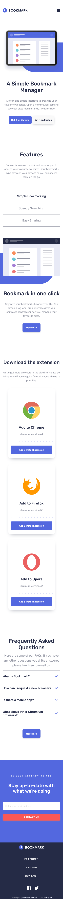
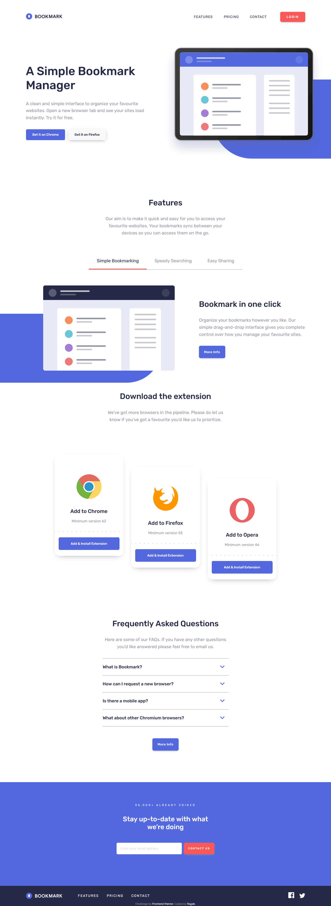

# Frontend Mentor - Bookmark landing page solution

This is a solution to the [Bookmark landing page challenge on Frontend Mentor](https://www.frontendmentor.io/challenges/bookmark-landing-page-5d0b588a9edda32581d29158). Frontend Mentor challenges help you improve your coding skills by building realistic projects.

## Table of contents

- [Overview](#overview)
  - [The challenge](#the-challenge)
  - [Screenshot](#screenshot)
  - [Links](#links)
  - [Built with](#built-with)
  - [What I learned](#what-i-learned)
  - [Continued development](#continued-development)
- [Author](#author)

## Overview

### The challenge

Users should be able to:

- View the optimal layout for the site depending on their device's screen size
- See hover states for all interactive elements on the page
- Receive an error message when the newsletter form is submitted if:
  - The input field is empty
  - The email address is not formatted correctly

### Screenshot

### Links

- Solution URL: [@Frontend Mentor]([https://www.frontendmentor.io/challenges/manage-landing-page-SLXqC6P5/hub](https://www.frontendmentor.io/solutions/responsive-solution-for-bookmark-landing-page-vanilla-js-WzTkPU9qaE))
- Live Site URL: [@Github Pages](https://ragabogaa.github.io/bookmark)

### Built with

- Semantic HTML5 markup
- CSS custom properties (Flexbox)
- Vanilla JS (functions and eventlisteners)

### What I learned

- To make tabs section, each tab has it`s own image and text
- Validate email input to check if it`s an email or not before submitting the form
- Make FAQ section _opens 1 question at a time_

### Continued development

Still working on my JS skills!
need more practice and more projects

## Author

- Website - [Ragaboga](https://github.com/RagaBoGaa)
- Frontend Mentor - [@RagaBoGaa](https://www.frontendmentor.io/profile/RagaBoGaa)
